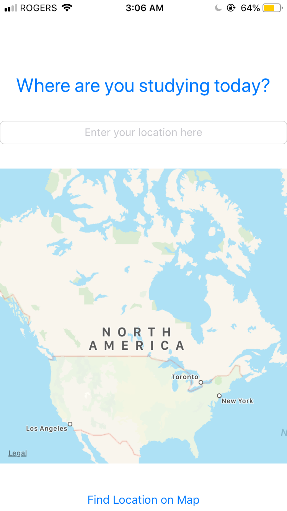

# OnTheMap_Udacity
The On The Map app allows users to share their location and a URL with their fellow Udacity students. To visualize this data, On The Map uses a map with pins for location and pin annotations for student names and URLs, allowing students to place themselves “on the map,” so to speak.  
   
# OnTheMap_Udacity Snapshots
    
